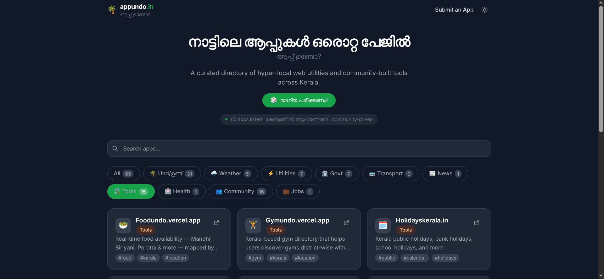

# 🏋️ GymUndo

> **Explore Gyms Across Kerala – Discover, Navigate & Contribute**

GymUndo is a modern web application that helps users discover gyms across all **14 districts of Kerala** through an interactive map. Users can explore gym locations, view images, check available facilities, and instantly navigate to any gym using Google Maps.

The platform also allows users to **add new gyms** and **edit existing gym details**, making it a collaborative and continuously growing directory for fitness enthusiasts.

---

# 🌴 Part of the AppUndo Universe

GymUndo is proudly featured on AppUndo, a curated directory of hyper-local web applications and community-built tools designed for the people of Kerala.
AppUndo brings together useful digital services across multiple categories—including utilities, transport, health, weather, community, and local discovery—making it easier for users to find practical solutions in one place.
As a member of the AppUndo ecosystem, GymUndo contributes to this vision by helping users discover gyms across all 14 districts of Kerala through an interactive, community-driven platform.

<div align="center">  </div>

--- 

## 🌟 Features

* 🗺️ Interactive Kerala map with gym locations
* 📍 Explore gyms across all **14 districts of Kerala**
* 🏋️ View gym information and facilities
* 🖼️ Browse gym images
* 📍 Open any gym location directly in Google Maps
* ➕ Add new gym details
* ✏️ Edit existing gym information
* 📱 Fully responsive design
* ⚡ Fast and lightweight user experience

---

## 🛠️ Tech Stack

* **React**
* **TypeScript**
* **Vite**
* **CSS**
* **Google Maps**
* **Git & GitHub**
* **Vercel**

---

## 📂 Project Structure

```text
gymundo/
├── public/
├── src/
│   ├── assets/
│   ├── components/
│   ├── data/
│   ├── pages/
│   ├── App.tsx
│   └── main.tsx
├── package.json
├── vite.config.ts
└── README.md
```

---

## 🚀 Getting Started

### Clone the repository

```bash
git clone https://github.com/iamkarthik2004/gymundo.git
```

### Navigate to the project

```bash
cd gymundo
```

### Install dependencies

```bash
npm install
```

### Start the development server

```bash
npm run dev
```

The application will be available at:

```text
http://localhost:5173
```

---

## 🗺️ How It Works

1. Open the GymUndo website.
2. Explore the interactive map of Kerala.
3. Click on any district to discover nearby gyms.
4. Select a gym to view:

   * Gym images
   * Facilities
   * Location
   * Additional details
5. Open the location directly in Google Maps.
6. Add a new gym or edit existing information to keep the directory updated.

---

## 🏋️ Gym Information Includes

* Gym Name
* District
* Address
* Google Maps Location
* Contact Details *(if available)*
* Available Facilities
* Gym Images

---

## 📸 Images

Gym images displayed in the application are referenced using **existing publicly available image URLs**. No images are stored directly within the project.

---

## 📍 Google Maps Integration

Every listed gym includes a Google Maps location, allowing users to navigate directly from the application with a single click.

---

## 🚀 Future Enhancements

* 🔍 Search gyms by name
* 🎯 Filter by district
* ⭐ User ratings and reviews
* ❤️ Save favourite gyms
* 📷 Image uploads
* 📞 Contact gym owners directly
* 🧭 Nearby gyms based on user location

---

## 🤝 Contributing

Contributions are welcome!

1. Fork the repository.
2. Create a new feature branch.

```bash
git checkout -b feature/NewFeature
```

3. Commit your changes.

```bash
git commit -m "Add new feature"
```

4. Push to your branch.

```bash
git push origin feature/NewFeature
```

5. Open a Pull Request.

---

## 📄 License

This project is licensed under the MIT License.

---

## 👨‍💻 Author

**Karthik Krishnan**

* GitHub: https://github.com/iamkarthik2004
* LinkedIn: https://www.linkedin.com/in/karthikkk708/

---

## ⭐ Support

If you found this project useful, consider giving it a **⭐ Star** on GitHub!

Happy Exploring! 🏋️🗺️
